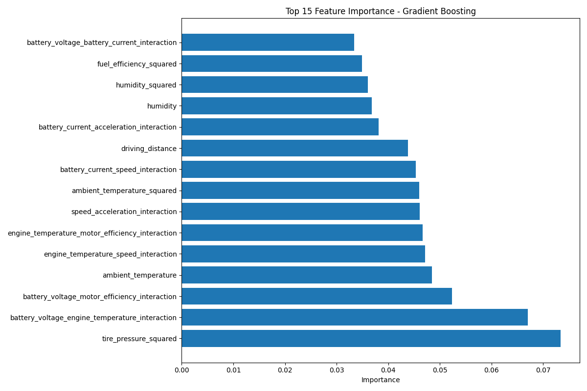
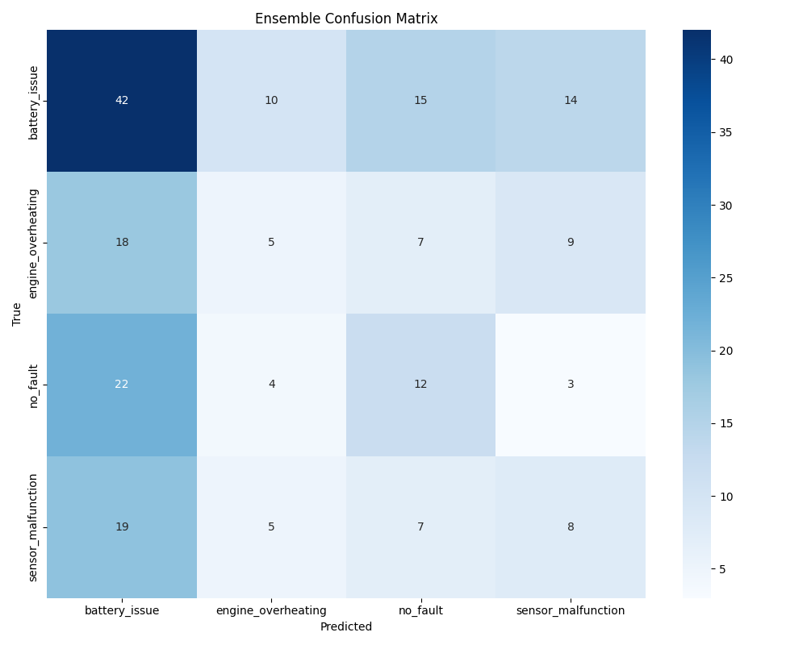
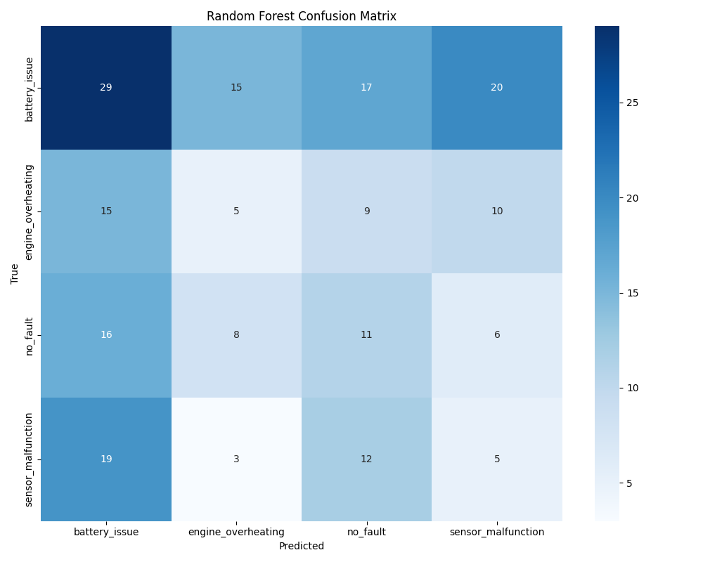

# نگهداری پیش‌بینانه برای خودروهای الکتریکی (Predictive Maintenance for Electric Vehicles)

<div align="center">
  
</div>


## 🚀 قابلیت‌ها (Features)

- **مهندسی ویژگی پیشرفته** - ساخت بیش از 100 ویژگی مشتق شده از داده‌های سنسور خام
- **تشخیص نقص چندکلاسه** - شناسایی دقیق مشکلات باتری، گرم شدن بیش از حد موتور، اختلالات سنسور و عملکرد نرمال
- **یادگیری ترکیبی** - ترکیب Random Forest، Gradient Boosting برای دقت بهینه
- **پیش‌بینی‌های قابل تفسیر** - نمایش اهمیت ویژگی‌ها برای شناسایی شاخص‌های کلیدی نقص
- **پایپلاین آماده تولید** - پردازش انتها به انتها از داده‌های خام تا بینش‌های عملی نگهداری

## 📊 آخرین بهبودها و عملکرد (Latest Improvements and Performance)

در آخرین آپدیت، بهبودهای قابل توجهی انجام شده است:

1. **اضافه کردن SMOTE برای متعادل‌سازی کلاس‌ها** - بهبود تشخیص در کلاس‌های با داده کمتر
2. **تنظیم هایپرپارامترها با RandomizedSearchCV** - بهینه‌سازی پارامترهای Gradient Boosting
3. **مهندسی ویژگی گسترده** - اضافه کردن ویژگی‌های مربع و تعامل برای بهبود قدرت پیش‌بینی
4. **انتخاب ویژگی‌های هوشمند** - استفاده از SelectFromModel برای انتخاب ویژگی‌های مهم

<div align="center">
  
  <p>ماتریس درهم‌ریختگی مدل ترکیبی (Ensemble Confusion Matrix)</p>
</div>

| مدل | دقت | F1 (وزن‌دار) | صحت | یادآوری |
|-------|----------|---------------|-----------|--------|
| Logistic Regression | 89% |  0.52 |  0.52 | 0.89 |
| logistic_lasso | 50% | 0.51 | 0.36 |  0.89 |
| **Support Vector ModelEnsemble** | **91%** | **0.83** | **0.96** | **0.99** |
| Decision Tree | 37% | 0.40 | 0.37 |  0.43  |
| Random Forest Classifier | 30% | 0.56  | 0.39 |  0.96   |

## 🛠️ نصب (Installation)

```bash

git clone https://github.com/yourusername/predictive-maintenance-EV.git
cd predictive-maintenance-EV


python -m venv venv
source venv/bin/activate  # On Windows: venv\Scripts\activate


pip install -r requirements.txt
```

## 🔍 استفاده (Usage)

### آموزش مدل‌ها (Training Models)

```bash

python src/train_advanced_model.py


python improve_model.py
```

### انجام پیش‌بینی‌ها (Making Predictions)

```python
import joblib


model = joblib.load('results/ensemble_model.pkl')
scaler = joblib.load('results/scaler.pkl')
selector = joblib.load('results/feature_selector.pkl')
le = joblib.load('results/label_encoder.pkl')


def predict_fault(new_data):
    
    processed_data = preprocess_new_data(new_data)
    
    prediction = model.predict(processed_data)
    return le.inverse_transform(prediction)
```

## 📈 بینش‌های کلیدی (Key Insights)

تحلیل مدل ما نشان می‌دهد:

1. **ویژگی‌های مهم**:
   - ولتاژ باتری
   - دمای موتور
   - بازدهی موتور
   - تعاملات ویژگی بین ولتاژ و جریان

<div align="center">
  
  <p>ماتریس درهم‌ریختگی Random Forest</p>
</div>

2. **الگوهای رایج طبقه‌بندی اشتباه**:
   - شرایط بدون نقص گاهی به اشتباه به عنوان مشکلات باتری طبقه‌بندی می‌شوند
   - گرم شدن بیش از حد موتور می‌تواند با اختلالات سنسور اشتباه گرفته شود

## 🔮 بهبودهای آینده (Future Improvements)

- رویکردهای یادگیری عمیق برای تشخیص الگوهای پیچیده
- تحلیل سری‌های زمانی برای تشخیص الگوهای پیشرفت نقص
- ادغام با سیستم‌های نظارت بلادرنگ
- تشخیص ناهنجاری برای انواع نقص طبقه‌بندی نشده

---

# Predictive Maintenance for Electric Vehicles

<div align="center">
  
</div>


An advanced machine learning system for predicting EV faults from sensor data, enabling preventative maintenance and reducing vehicle downtime.

## 🚀 Features

- **Advanced Feature Engineering** - Creates 100+ derived features from raw sensor data
- **Multi-class Fault Detection** - Accurately identifies battery issues, engine overheating, sensor malfunctions, and normal operation
- **Ensemble Learning** - Combines Random Forest and Gradient Boosting for optimal accuracy
- **Interpretable Predictions** - Feature importance visualization identifies key fault indicators
- **Production-Ready Pipeline** - End-to-end processing from raw data to actionable maintenance insights

## 📊 Latest Improvements and Performance

In the latest update, significant improvements have been made:

1. **Added SMOTE for class balancing** - Improved detection in underrepresented classes
2. **Hyperparameter tuning with RandomizedSearchCV** - Optimized Gradient Boosting parameters
3. **Extensive feature engineering** - Added squared and interaction features to improve predictive power
4. **Intelligent feature selection** - Used SelectFromModel to identify important features

<div align="center">
  
  <p>Ensemble Model Confusion Matrix</p>
</div>

| Model | Accuracy | F1 (weighted) | Precision | Recall |
|-------|----------|---------------|-----------|--------|
| Logistic Regression | 89% |  0.52 |  0.52 | 0.89 |
| logistic_lasso | 50% | 0.51 | 0.36 |  0.89 |
| **Support Vector ModelEnsemble** | **91%** | **0.83** | **0.96** | **0.99** |
| Decision Tree | 37% | 0.40 | 0.37 |  0.43  |
| Random Forest Classifier | 30% | 0.56  | 0.39 |  0.96   |

## 🛠️ Installation

```bash
# Clone repository
git clone https://github.com/yourusername/predictive-maintenance-EV.git
cd predictive-maintenance-EV


python -m venv venv
source venv/bin/activate  

# Install dependencies
pip install -r requirements.txt
```

## 🔍 Usage

### Training Models

```bash

python src/train_advanced_model.py


python improve_model.py
```

### Making Predictions

```python
import joblib

# Load the saved model components
model = joblib.load('results/ensemble_model.pkl')
scaler = joblib.load('results/scaler.pkl')
selector = joblib.load('results/feature_selector.pkl')
le = joblib.load('results/label_encoder.pkl')


def predict_fault(new_data):
   
    processed_data = preprocess_new_data(new_data)
    
    prediction = model.predict(processed_data)
    return le.inverse_transform(prediction)
```

## 📁 Project Structure

```
predictive-maintenance-EV/
├── data/                    
│   └── Fault_nev_dataset.csv
├── src/                     
│   ├── modeling.py          
│   ├── preprocessing.py     
│   ├── utils.py            
│   └── train_advanced_model.py 
├── results/                 
│   ├── ensemble_model.pkl   
│   ├── rf_confusion_matrix.png 
│   ├── ensemble_confusion_matrix.png 
│   ├── gb_feature_importance.png 
│   └── feature_selector.pkl 
├── improve_model.py        
├── requirements.txt         
└── README.md                
```

## 📈 Key Insights

Our model analysis shows:

1. **Most Important Features**:
   - Battery voltage
   - Engine temperature
   - Motor efficiency
   - Feature interactions between voltage and current

<div align="center">
  
  <p>Random Forest Confusion Matrix</p>
</div>

2. **Common Misclassification Patterns**:
   - No-fault conditions sometimes misclassified as battery issues
   - Engine overheating can be confused with sensor malfunctions

## 🔮 Future Improvements

- Deep learning approaches for complex pattern recognition
- Time-series analysis to detect fault progression patterns
- Integration with real-time monitoring systems
- Anomaly detection for unclassified fault types

## 📄 License

This project is licensed under the MIT License. See the [LICENSE](LICENSE) file for details.

## 🤝 Contributing

Contributions are welcome! Please feel free to submit a Pull Request. 
